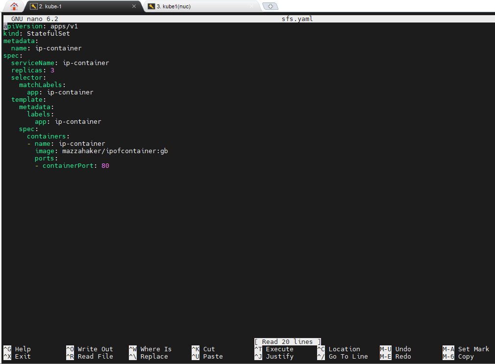
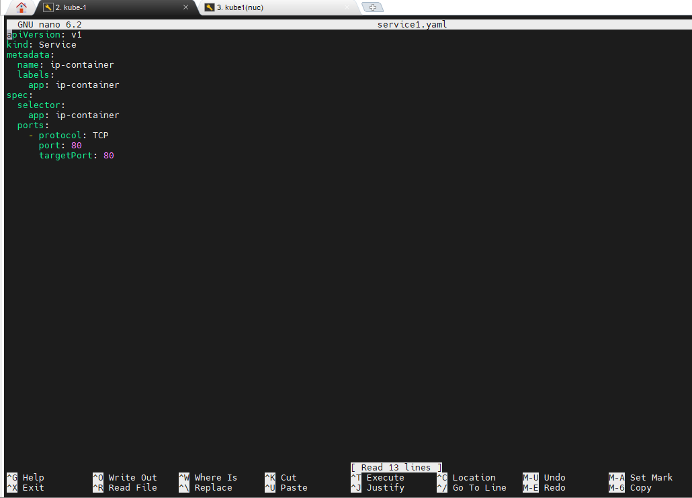
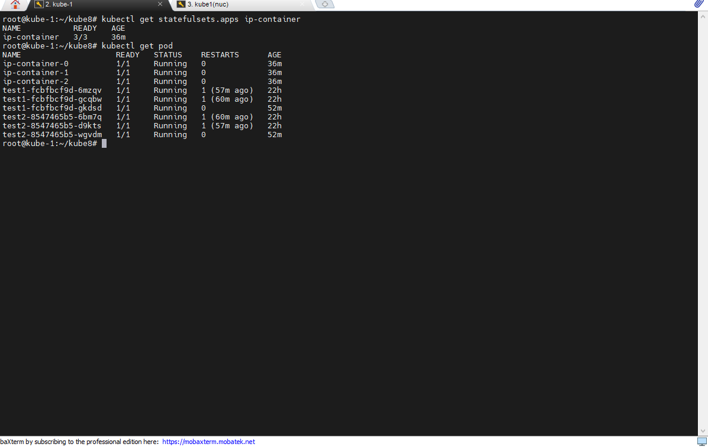
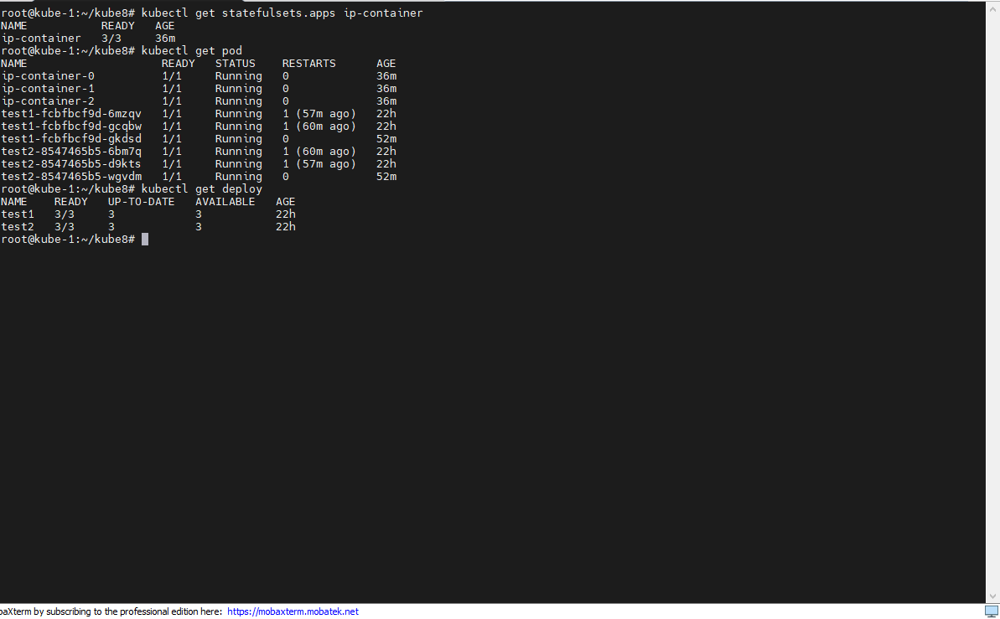

# Урок 8. Знакомство с сущностями Kubernetes. Часть 2

1.  Создадим Statefulset 

- конфиг statefulset прописан в yaml - файле

2. Напишем сервис для statefulset

- конфиг сервиса

3. Создадим несколько деплоев и сервисов без использования манифестов, с помощью команды create и expose
- kubectl create deployment test1 --image mazzahaker/ipofcontainer:gb --replicas 3
- kubectl create deployment test2 --image mazzahaker/ipofcontainer:gb --replicas 3
- kubectl expose deployment test1 --port=80
- kubectl expose deployment test2 --port=80

Проверим что созданные сущности запустились и работают:

- statefulset 

- deployments

- service

